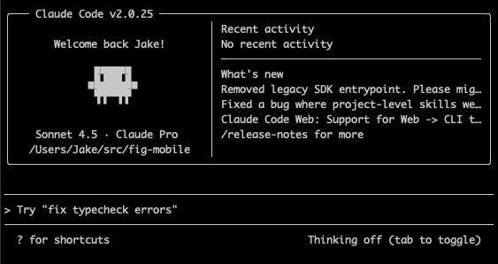
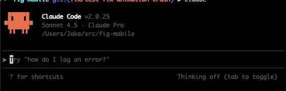

import Comments from "components/Comments";

Recently, I had trouble getting my Metro bundler to Fast Refresh my simulator app while debugging locally. This was really frustrating because in order to see changes reflected locally, I had to stop the bundler and restart it.

My first thought was to use our "nuke" command, which deletes all the relevant caches for our repo. This deleted the React and Metro caches, removed `node_modules`, deleted all Watchman watches, and removed the Android and iOS build and pod files. This sadly did not work.

Then I went over to Claude Code and tried to describe my problem. I used the following prompt:

```
my metro bundler is not hot reloading my react native app when I save or
reload. Can you help me debug why this is? First list possible issues and
then let's try to resolve.
```

This was helpful because it listed Watchman as a particular issue and I was able to debug that I didn't have Watchman appropriately installed. The fix for this was a simple `brew install watchman`. However, this still did not work. It then tried to fix a few things in my `metro.config.js` because I had a warning and also prompted me to make sure I had [Fast Refresh](https://reactnative.dev/docs/fast-refresh) turned on. At this point, the suggestions were getting less useful, so I decided to turn to Google.

It was hard to figure out which package exactly was the problem. It could be an issue with React Native, Metro, Watchman, Expo, etc. The problem was finding the right one. One thing I discovered was that when I opened DevTools for React Native, the `[metro-project]` folder was changing but not the `index.bundle`. I tried again in Claude Code to no avail. Then I queried Google: `metro project updates not getting rebundled`. This led me to [this post](https://github.com/facebook/metro/issues/917) in the Metro GitHub. I scrolled through the comments and eventually found [this comment](https://github.com/facebook/metro/issues/917#issuecomment-1398462276), which suggested:

> If a CI is being detected due to some odd environment variable, running this from your project root might show some clues:
> `node -p "require('ci-info')"`

Ah-ha! Maybe I had set a weird environment variable. At this point, I remembered a while back that we have a CI variable set in the environment file of one of our repos. I went to check there, and sure enough I had to clear it from the environment. Once I cleared this using `unset` everything cleared up.

As a side note, this also affected Claude Code. You can see a comparison in these pictures:

| CI                                                          | Not CI                                                         |
| ----------------------------------------------------------- | -------------------------------------------------------------- |
|  |  |

<Comments />
