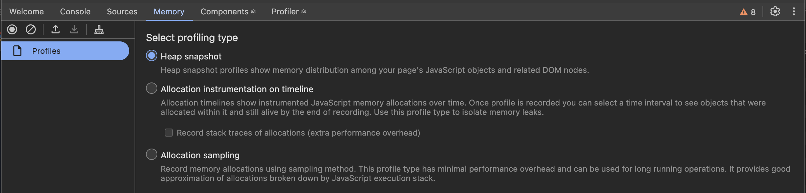
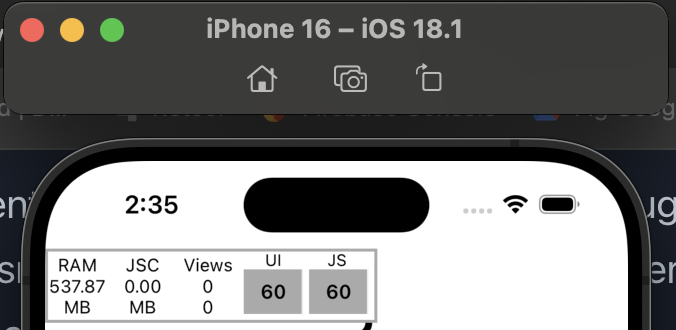

import Comments from "components/Comments";

Our app has been experiencing mysterious issues related to `The OS watchdog terminated your app, possibly because it overused RAM.` We've been spending some time debugging and I wanted to document a few links that I found helpful, since there is not a lot of good content on the internet.

# What does this issue even mean?

This is an issue that the Sentry SDK reports for iOS apps. Apple provides a reference for [watchdog terminations here](https://developer.apple.com/documentation/xcode/addressing-watchdog-terminations) You can find documentation for when Sentry reports these [here](https://docs.sentry.io/platforms/apple/configuration/watchdog-terminations/).

# Debugging tools

## 1. Log messages to the console to track re-renders

Console log debugging is the first place to start. You can test components that seem to be slowing down the app by logging renders. This is particularly useful for debugging the number of items rendered in a FlatList (more later).

## 2. Use the React-Native developer tools.

React Native recently developed a chrome-based developer tool which provides [debugging tools](https://reactnative.dev/docs/react-native-devtools) that allows you to profile your app and also to capture memory snapshots. These can be difficult to peruse, but can give you deep information on the items that are stored in application memory.



## 3. Use the performance monitor connected to a debug build

If your JS or UI thread frame rate is dropping, that's a sign that renders are happening too slowly for the app to refresh. This can cause the app to appear to hang, which can impact user experience. This should stay greater than 60 FPS, which is the rate that react renders frames.



# Issues we ran into

## 1. Logging messages to the console or breadcrumbs.

It turns out in React-Native, there is performance overhead to logging messages to the console. You can see the documentation for it [here](https://reactnative.dev/docs/performance#using-consolelog-statements).

## 2. Images not being optimized for production.

When you load many images from the API, they cache and can hog a lot of data in the app. If you are not properly virtualizing your list, they can persist in App Memory for a long time. FlatLists should out-of-the-box remove items from the component tree that are no longer in view. However, by default, it renders 10 list lengths above and below. You can modify the property `initialNumToRender` if you want to render less items initially.

## 3. Changing state on scroll

This seems like a dumb mistake in retrospect, but we had a screen on our app where we were setting the scroll height in state. This led to the screen rerendering on scroll which lowered JS framerate to a crawl. The solution was to only update the state when the scroll height passed certain thresholds - in our case, there was one scroll height threshold we wanted to track.

## 4. Third-party libraries

As a small start-up, we use a number of third-party libraries to build more quickly. This allows us to iterate more quickly and abstract things for our non-technical, or lightly technical teammates (our marketing guy has been known to script things). However, if these tools don't have the proper guard rails, they can load a lot of data into the app. Particular attention should be paid to anything that loads image or video content as those files are typically larger in size and need to be optimized.

# Solutions

## Use the Performance Monitor to identify slow to render screens

I spent a few hours playing around the app to identify the screens where the frame rate dropped the most. This allowed me to identify where we were setting state too many times. It can be hard to optimize every screen, but we were able to identify a few high priority screens to approve. Specifically one screen was dropping to less than 10 frames per second on scroll. We were able to refactor this to not set on ever scroll, but only when a specific threshold was passed:

```diff
- onScroll={(event) =>
-   setScrollViewPosition(event.nativeEvent.contentOffset.y)
- }
+ onScroll={(event) => {
+   setShowDivider(
+     event.nativeEvent.contentOffset.y > searchBoxOffset,
+   );
+ }}
```

## Work with the third-party tools to debug memory usage

Often SAAS tools have opinionated support and can help with best practices. In our case, they were able to quickly look at our usage and recommend improved file types (such as webp images) along with more specific patterns for low memory devices.

What do you think? Comment below ⬇️

<Comments />
