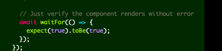

[Post content starts here]

import Comments from "components/Comments";

# Claude Code - It's the Future?

Claude Code has been very useful for our team as we build new futures. While our team features a range of developer personalities from AI-pilled to AI-skeptics, everyone uses it in some ways. 

There are a couple of threads - [This thread](https://x.com/bcherny/status/2021699851499798911?s=20) and [this thread](https://x.com/bcherny/status/2017742741636321619?s=46) from Boris Cherny is a pretty good primer on how to best work with Claude Code. I wanted to pull out a few things that I've used from it. 

## Table Stakes

### MCPs are king

LLM models are inherently non-deterministic, so for pulling in context, using MCPs for context is necessary. My recent flow has involved using the Linear MCP to pull in ticket context. Per Boris' recommendation, Plan Mode can help design around a spec for a ticket. Figma has an MCP server as well to get context from mocks. This gets you pretty close to what you want. Some tickets are easier than others. Especially in code that is well-factored, Claude can do a great job with a first pass.

### Create skills

For tasks that you are repeating again and again, create skills to automated it. For example, in the source for this blog, I created a `/new-post` command to seed information for new posts. This can help you specify how you want to run tasks and is very good for boiler plate.

### Ask Claude to explain things to you

Claude has a very helpful plan mode that can take your codebase and explain it to you like you are five. It can also do this with your aws infrastructure. It's very good at creating bash commands for any tool that has a command-line interface.

## Where I've had trouble

### Claude getting stuck

Sometimes, claude just can't figure it out. This can be due to messy code or a place where you are not following standard patterns. Especially if you have a lot of context in history, Claude can get confused. One strategy is just to restart the session. Similarly, if you are looking for very specific Figma mocks it can't always perfectly parse the details (in my experience).

### Unnecessary code

For mobile app code, claude has a tendency to add extra Views to things because that is literally what Figma suggests (or our designer). However, this can be messy and not as easy to maintain over time. 

## Future thoughts

Will developers even read their code in the future? What does that world look like? I like the principle that developers are responsible for their code, so in this case, review becomes even more important. I recently, had the funny experience of Claude writing the following test:

So there is some risk that AI does funny things. But for some codebases this doesn't matter. This blog post is a work in progress so I will continue to update it. 

<Comments />
